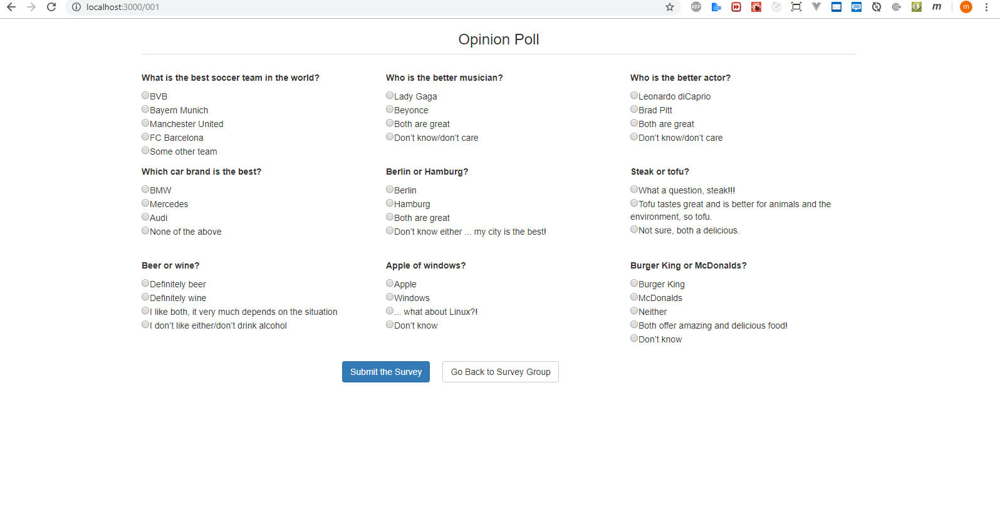

React js personal project with api

For running this code , you need to do following

You need to install node module by `npm install`
Then by `npm start`
This should start the Default React HTTP server 

Please see the screenshot to see the view

